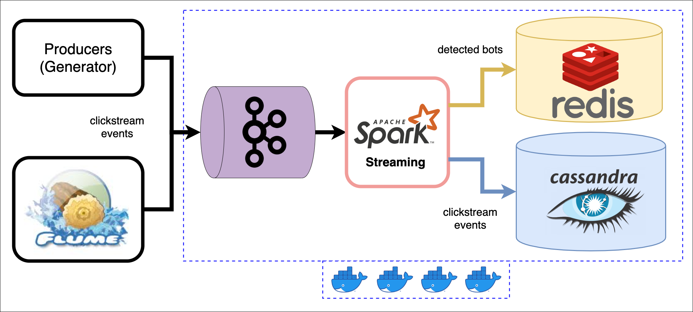

# bot-detector

## Task
Bot detection algorithm: more than 20 requests per 10 seconds for single IP.
IP should be whitelisted in 10 minutes if bot detection condition is not matched.
It means IP should be deleted from Redis once host stops suspicious activity.
System should handle up to 200 000 events per minute and collect user click rate and transitions for the last 10 minutes.

## Design
Redis is use as a cache, Cassandra is use as permanent storage for all incoming events.

## Up environment
* Run `docker-compose up` to up environment which describe in `docker-compose.yml`
* Run `init.sh` to prepare environment
* Run `run-flume.sh` to start flume connector File => Kafka (Optional)
* Run `./generate-events.sh` to generate events for stream (use botgen.py)
* Execute `spark-submit-sstream-job.sh` to run spark-stream.